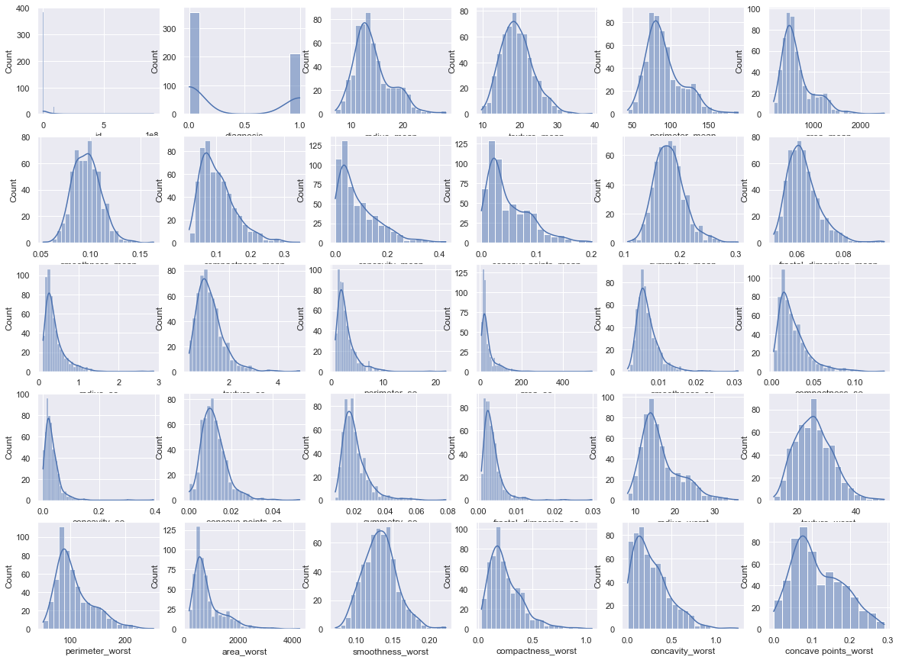
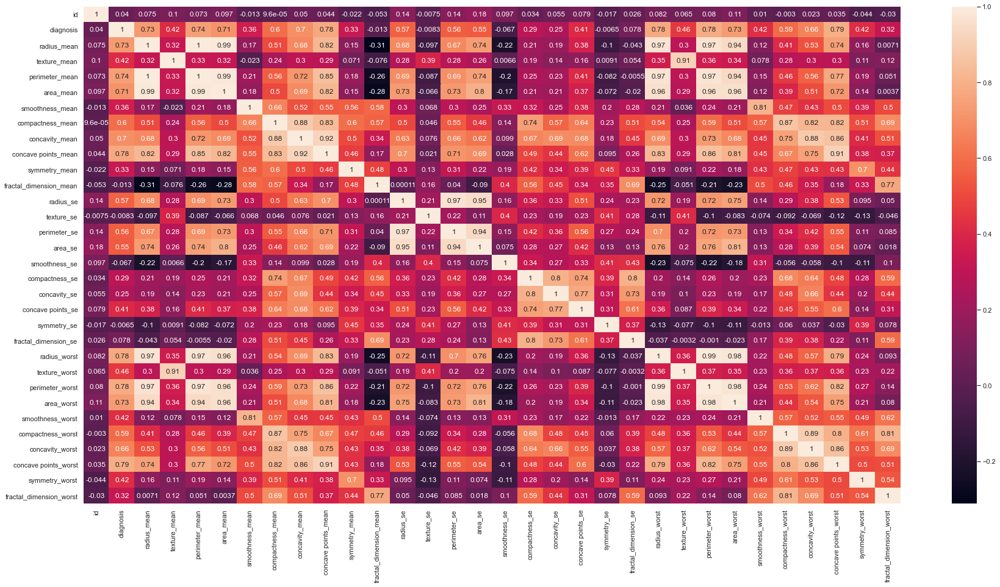
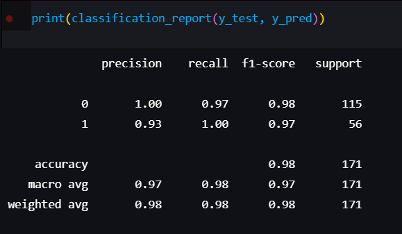

# Cancer Prediction Research

## Why?
In our time, the study of diseases, their development is extremely important. It is equally important to look for ways to prevent them. This research could be used in medicine for the treatment and prevention of cancer.

## How? 
I mainly use Python in conjunction with the standard DS set - numpy, pandas, sklearn, matplotlib.

## Highlights
### Correlation plot

### Correlation heatmap

### Results
