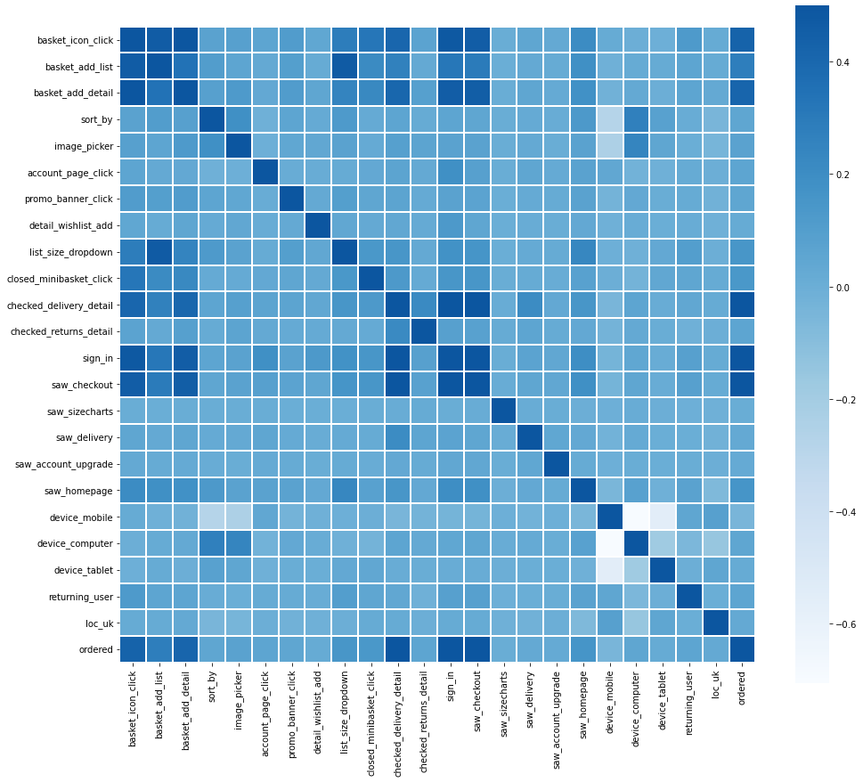

# Customer Propensity Research

## Why? 
The aim of this research is to try to predict user actions on the site. Will he subscribe to the channel, will he buy something, and so on. It can help in maintaining site statistics, help increase sales and views, and much more.

## How?
I use Python almost as always, and the standard DS kit.

## Highlights

## [Results](results.csv)